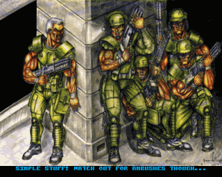
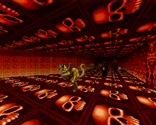
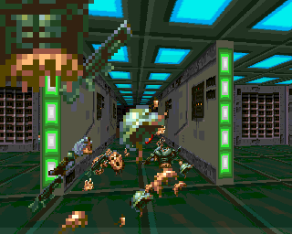

# ZGloom

A re-implementation of [Amiga FPS Gloom](https://en.wikipedia.org/wiki/Gloom_(video_game)), including support for Zombie Massacre.

# Screenshots

# Instructions

## Windows

There is a pre-compiled inside the [bin](bin) folder or you can use one of the [releases](https://github.com/Swizpig/ZGloom/releases). It needs the VS2013 runtime.

## Linux

1. Install libSDL2, libSDL2_mixer and [libXMP](https://github.com/cmatsuoka/libxmp).
2. Compile with `make`.

# How to play

Gloom was made freely available by its developers [here](https://github.com/earok/GloomAmiga/archive/master.zip). Download, unzip and move the ZGloom binary inside the uncompressed directory before run it. 

# Default Controls

Cursors, left alt to strafe, left ctrl to fire. F1 skips level. F12 toggles fullscreen. PrintScreen dumps a bitmap. Escape pauses the action and shows the menu.

# In-game music

ZGloom can now add in-game music using any module that XMP can play. Put the mods in the sfxs folder and add "song_blitz.mod" or whatever the module name is to the script. Multiple song_ commands are allowed, allowing per-level music.

# TODO

* Backend of the renderer is mostly mine, and is flaky. There's Z-fighting that doesn't exist in the original, for instance
* Sound is deafening on occasion, need variable volume playback and priority system
* Player rotation acceleration
* Incomplete HUD and infinite lives currently
* Very basic in-game menu. Much more stuff needs to be configurable
* No defender sub-game
* LibXMP's MED playback isn't great on some tunes

# License

Dunno. [The Gloom source release](https://github.com/earok/GloomAmiga) says only the .s and .bb2 files are open source, but the Gloom executable bakes in some maths lookup tables (but then, they are generated by the .bb2 files), bullet and sparks graphics, and 
the title screen for Classic Gloom. I probably won't add the latter and just display the Black Magic image, or something.

Uses LibXMP for MED playback
http://xmp.sourceforge.net/

Uses SDL2 and SDL2 mixer
https://www.libsdl.org/

DeCrunchmania C code by Robert Leffman, licence unknown
http://aminet.net/package/util/pack/decrunchmania_os4
